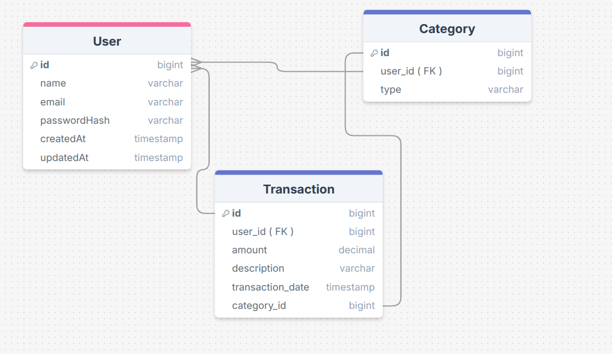

# 💰 Budgeting App

A full-stack personal finance tracker built with **Spring Boot**  **Next.js** and **Flutter**.

## 🚀 Tech Stack

- **Frontend**: Next.js 15, flutter , TypeScript, Tailwind CSS, Framer Motion, Recharts
- **Backend**: Java Spring Boot, Spring Data JPA, Hibernate, Maven
- **Database**: PostgreSQL (Production) / H2 (Dev)
- **API Documentation**: SpringDoc OpenAPI (Swagger UI)

## 🏗️ Architecture & Database Schema

The application uses a relational database to efficiently store transactions and categories without data redundancy.

### Entity Relationship Diagram (ERD)



### Key Design Decisions

1. **Category Linking**: Transactions reference a `Category` ID instead of storing the category name/type directly. This normalization allows for renaming categories or changing budgets without updating thousands of transaction rows.
2. **Enum Strategy**: The `Category` table stores the `type` (INCOME, EXPENSE, SAVINGS) as a string. The backend logic enforces these types.
3. **BigInt vs Varchar**: Foreign keys (`user_id`, `category_id`) are stored as `bigint` to match the primary keys of the referenced tables. This ensures distinct numerical linking.

## 🛠️ Getting Started

### 1. Backend (Spring Boot)

The backend runs on port `8080`.

```bash
cd backend/demo
./mvnw spring-boot:run
```

- **API Docs**: Access Swagger UI at `http://localhost:8080/swagger-ui.html` (once running).
- **H2 Console**: Access the dev database at `http://localhost:8080/h2-console`.

### 2. Frontend (Next.js)

The frontend runs on port `3000`.

```bash
cd frontend
npm install
npm run dev
```

Open [http://localhost:3000](http://localhost:3000) to view the dashboard.

## ✨ Features

- **Dashboard**: Interactive graphs showing spending trends.
- **Smart Categorization**: Automatically finds or creates categories based on user input.
- **Form Validation**: Clean UI for adding Income, Expenses, or Savings.
- **Responsive Design**: Works on mobile and desktop using modern glassmorphism UI.
